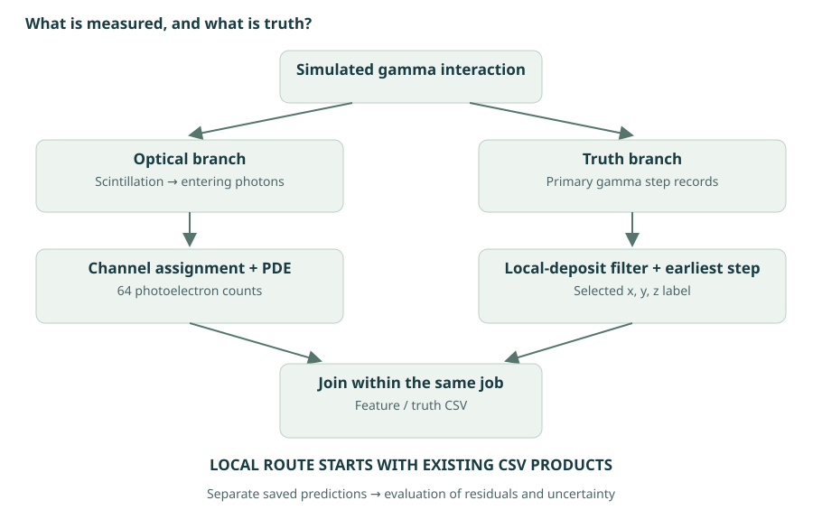
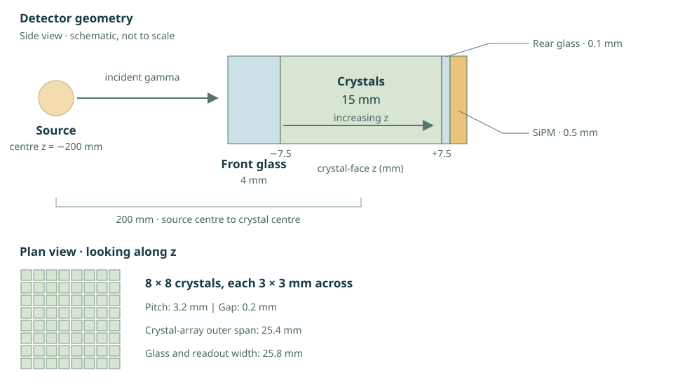

# Detector and light sharing

A PET scanner detects gamma rays associated with positron annihilation. This project studies **one detector module’s response to an individual incident gamma**, principally near 511 keV. It asks how much three-dimensional position information can be recovered from a single readout side.

## From gamma ray to a light map

A gamma transfers energy through interactions such as **photoelectric absorption** or **Compton scattering**. Charged secondaries deposit energy in a scintillator, producing optical photons: **scintillation**. Some of that light reaches silicon photomultipliers (**SiPMs**), which detect photons as photoelectrons.

The simulation/analysis route turns the response into **64 counts**, one for each virtual channel. These are the model’s measurements. The interaction coordinates used to assess predictions come separately from simulation truth.

<figure class="figure">

<figcaption>Conceptual data flow. Simulation and ROOT reduction normally run together on UCD Sonic. Local exercises start with the resulting CSV products. The feature and prediction samples supplied here are separate historical examples.</figcaption>
</figure>

## What the module looks like

The current geometry has **8 × 8 crystals**, each **3 × 3 × 15 mm**, on a **3.2 mm pitch**. A 4 mm front glass light guide allows light redistribution; a thin rear glass layer couples the crystal ends to the continuous silicon readout block. Optical border surfaces represent reflection at selected interfaces.

<figure class="figure">

<figcaption>Editable schematic checked against the current simulation script; not to scale. The 25.4 mm crystal-array outer span differs from the 25.8 mm glass/readout width. The source distance is centre to centre.</figcaption>
</figure>

The continuous SiPM block is divided into virtual 3 × 3 mm acceptance regions during analysis. Photons in the gaps are rejected. The current response then samples a binomial detection probability of **0.30**. It does not include dark counts, crosstalk, afterpulsing, saturation or electronic noise in this route.

## Why depth might affect the pattern

**Depth of interaction (DOI)** is the position through the 15 mm crystal length. Changing depth changes the optical paths and the opportunities for light to spread into neighbouring channels. Total light, the dominant-channel fraction and the transverse spread can therefore carry complementary clues.

A map can still be ambiguous. Finite photon statistics, light loss, multi-site gamma interactions and similar optical paths can make different positions look alike. This motivates predicting an uncertainty or even a multi-peaked depth density, rather than one location alone.

!!! note "Design intent and implemented optics"
    The surface named `Diffuse_front` is currently polished, with an empty property table; the glass has no explicit bulk-scattering table. Do not describe it as a demonstrated physical diffuser. The proposed connection between total internal reflection and depth bias remains a hypothesis.

## Check your understanding

1. Why is a light-map channel not necessarily a direct record of the first interaction’s crystal?
2. Why would a correct transverse location still leave uncertainty along the crystal length?
3. Which additional measurement would you want before attributing a bias to total internal reflection?

Source: `module-sim-doi-511-cone-array.py` and `analyse-array.py`, under `project/hpc-15-07/`. Detailed defaults are in [geometry and model reference](../reference/physics.md).

Next: [coordinates, energy and truth →](coordinates.md)

