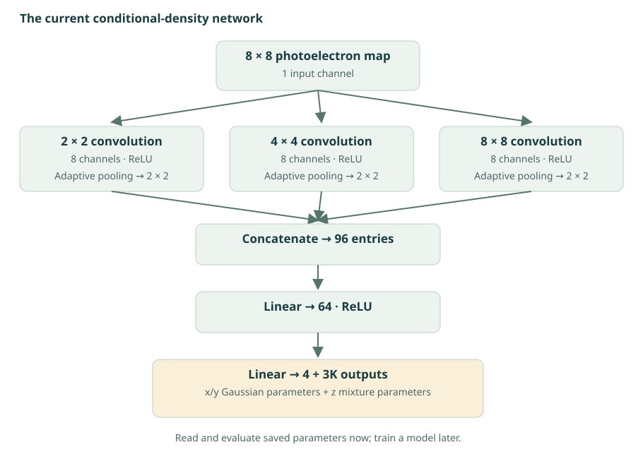

# From light maps to conditional densities

The input is an 8 × 8 image of photoelectron counts, called **X**. A convolutional neural network (**CNN**) extracts patterns and predicts a probability density for the interaction position given that image. The informal name **“3D chess”** links the 8 × 8 input to a three-dimensional output.

## A density carries more information than one position

For x and y the model predicts a Gaussian mean and width. For z it predicts a **Gaussian mixture model (GMM)**: a weighted sum of K Gaussian densities. This can describe asymmetric or multi-peaked depth uncertainty.

p(z | X) = ∑k=1K πk(X) N(z; μk(X), σk2(X))

For each event, the weights sum to one and each component width is positive. A component is a mathematical contribution to a density; it is **not automatically a photoelectric or Compton category**.

The full implemented density factorizes as `p(x,y,z | X) = p(x | X) p(y | X) p(z | X)`. It does not model a full correlated three-dimensional mixture. Its z density is not truncated at the crystal faces; component means can lie outside the physical interval.

## How the CNN produces the parameters

<figure class="figure">

<figcaption>Current architecture, from `SimpleCNN` in the authoritative trainer. The 8 × 8 branch has only one spatial value before pooling; expanding it to 2 × 2 repeats information. The 96 entries are not 96 independent degrees of freedom.</figcaption>
</figure>

The `4 + 3K` outputs encode two means and two log-widths for x/y, then K logits, K means and K log-widths for z. Softmax turns logits into normalized weights; clamping and exponentiation produce widths. Default image normalization is `none`. Truth coordinates and process labels are not input pixels.

## What learning a density means

Training minimises negative log likelihood: the model is rewarded for assigning high density to the observed truth. For a Gaussian, the loss contains both a squared-error term divided by the variance and a `log σ` term. The latter prevents unlimited uncertainty inflation from being a free way to reduce the error term.

You do **not** need to train a network to study these ideas. The supplied prediction CSV already contains its output parameters. The evaluator reads that CSV; it does not load weights or perform inference on new images.

## Summarising the depth density

| Estimate | Question answered | Implementation |
| --- | --- | --- |
| Mean | Which point minimises expected squared error? | Weighted sum of component means |
| Median | Which point splits the probability in half? | Numerical CDF bisection |
| Mode | Where is the density greatest in the physical interval? | Maximum on an 801-point grid from −7.5 to +7.5 mm |

The saved effective uncertainty includes both the widths within components and the separation between component means:

z̄ = ∑ πk μk σz2 = ∑ πk(σk2 + μk2) − z̄2

The same mixture standard deviation is retained when evaluating the median or mode. It does not become a width centred on the newly selected point estimate.

## Why the predicted histogram may be narrower

An uncertain event’s conditional mean can lie near the centre even if its true position lies towards an end. Across events, the spread of conditional means need not equal the spread of truth:

Var(z) = Var(E[z | X]) + E[Var(z | X)]

Consequently, a mismatch between the histogram of point predictions and the truth histogram is not by itself a failure to learn absorption physics. Compare conditional behaviour, errors and calibration too. Adding mixture components does not remove this effect if the reported position remains the mean.

## Check your understanding

1. How many outputs are required for K = 1, 4 and 16?
2. Why can the mean lie between two high-density peaks?
3. Why does a small predicted σ not by itself prove that the event is accurate?

??? note "Reasoning checks"
    There are 7, 16 and 52 outputs. The mean averages positions, so it need not coincide with either peak. Predicted uncertainty is a model output; its relationship to actual error must be tested on held-out data.

Source: `train-cnn-array-xyz-gmm.py::SimpleCNN`, `split_xy_zgmm_output`, `xy_zgmm_nll_terms`; `evaluate_cnn_performance.py` estimator functions.

Next: [set up the local exercises →](../practicals/setup.md)

