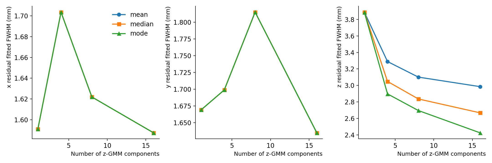

# 6 · Compare component counts

<span class="status">Saved-metrics comparison</span>

## Why am I doing this?

Explore how the reported diagnostics vary with K = 1, 4, 8 and 16, while distinguishing fitted core width from overall errors. This exercise **renders saved metrics** from larger historical studies; it does not rerun their predictions or training.

## What do I run?

**Working directory: `project/hpc-15-07`**, analysis environment active.

```bash
python plot_gmm_component_performance.py  \
  --input-dir .  \
  --outdir student-runs/model-comparison
```

It scans `cnn-gmm-n*-50M/z-gmm-{mean,median,mode}/metrics-standalone-eval.json`. Preserve that layout. The `50M` folder suffix is a naming convention, not verified evidence of the accepted training/test count.

## What should I see?

Expect **six PNGs and a 36-row CSV**, `gmm-component-performance-summary.csv`: four component counts × three estimators × three coordinates. The supplied `model-comparison/gmm-component-performance-summary.csv` provides a reference for the table values.

<figure class="figure">
<a href="../assets/component-fwhm.png" title="Open full-size figure"></a>
<figcaption>Re-rendered saved historical metrics, not a fresh model study. Missing fitted points are excluded according to fit-success flags. Colours and distinct markers identify the point estimators.</figcaption>
</figure>

## How do I know it worked?

Check the table dimensions and grouping:

```bash
python - <<'PYCODE'
import pandas as pd
df = pd.read_csv('student-runs/model-comparison/gmm-component-performance-summary.csv')
print('Rows:', len(df))
print(df.groupby(['axis', 'estimator']).size())
assert len(df) == 36
assert set(df.n_components) == {1, 4, 8, 16}
PYCODE
```

Read the FWHM plot alongside population-standard-deviation and MAE plots. Low-uncertainty plots use **per-axis median cuts**, so x/y/z panels can describe different selected rows. The comparison route does not currently export low-uncertainty MAE.

## What can I conclude?

You can describe what the saved metrics show. You cannot yet conclude that increasing K causes a robust general improvement: producing configurations, matching data splits and repeated seeds are missing. The large prediction CSVs and checkpoints are not supplied.

Selecting K using these test results and then quoting the same results as an unbiased final performance estimate would require a separate held-out evaluation. A controlled comparison should record inputs, splits, seeds, preprocessing and an agreed task metric.

## Questions to discuss

- Why might x/y metrics change across K even though only z uses a mixture?
- Why should x/y all-event metrics remain fixed when changing only the z estimator for a fixed model?
- What evidence would you ask for before recommending a particular K?

## Shared-route completion

You have completed the shared route when you can reproduce the galleries, explain the truth definition and residual sign, distinguish the selections, and justify a metric choice. Save your commands, input identities and a short interpretation of one result.

[Later extensions](../later.md) explain how new inference, training and simulation fit into the wider workflow.
