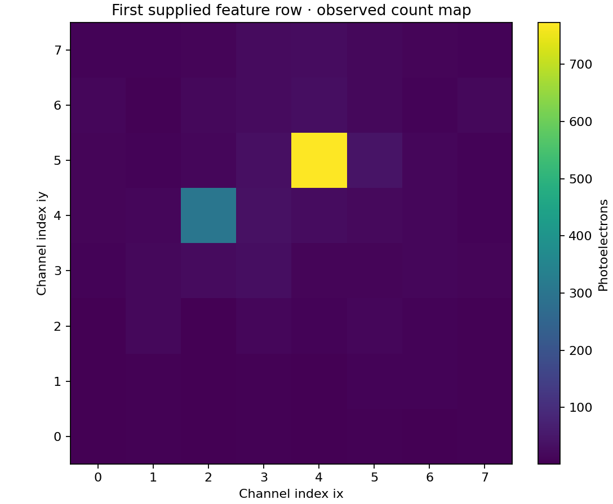

# 1 · Read a light map

**Goal:** distinguish measured light counts from simulation truth and check the CSV before interpreting plots.

## Why am I doing this?

A misplaced axis or inconsistent count sum can undermine every later conclusion. The input `project/hpc/test.csv` contains **2,082 historical rows and 64 channel columns**. It was supplied as a feature example; its original producing configuration is not fully known.

## What do I run?

**Working directory: `project/hpc-15-07`**, with the analysis environment active. This inspection only checks existing columns; it does not replace the research calculations.

```bash
python - <<'PYCODE'
import pandas as pd

df = pd.read_csv('../hpc/test.csv')
pe = [f'pe_{ix}_{iy}' for ix in range(8) for iy in range(8)]
missing = [name for name in pe if name not in df.columns]
print('Rows:', len(df))
print('Missing PE columns:', missing)
assert not missing, 'Check the input schema before continuing'
counts = df[pe]
assert counts.notna().all().all()
assert (counts >= 0).all().all()
print('Largest count-sum difference:',
      (counts.sum(axis=1) - df.total_pe).abs().max())
print(df[['total_pe', 'max_pe', 'frac_max', 'spread',
          'x_gamma', 'y_gamma', 'z_gamma']].head())
print(df[['x_gamma', 'y_gamma', 'z_gamma']].agg(['min', 'max']))
PYCODE
```

## What should I see?

Expect 2,082 rows, no missing PE columns and a maximum count-sum difference of zero for this packaged file. The truth table should use millimetres; z lies within the crystal interval. Further input details are in the [example data checks](../reference/data-checks.md).

<figure class="figure">
<a href="../assets/light-map.png" title="Open full-size figure"></a>
<figcaption>Actual first CSV row, shown only to illustrate channel orientation. This new teaching visualization does not estimate DOI or replace any scientific evaluation. Its source is included in `tools/make_teaching_figures.py`.</figcaption>
</figure>

## How do I know it worked?

Explain what each observable tells you:

| Observable | Read it as | Do not read it as |
| --- | --- | --- |
| `total_pe` | Total modelled detected light | Automatically true deposited energy |
| `max_pe` | Largest single-channel count | A universally calibrated energy measurement |
| `frac_max` | Dominant-channel share of total light | A guaranteed unique depth estimate |
| `spread` | PE-weighted RMS distance from centroid in **pixel-index units** | A length already in mm |
| `x_gamma`, `y_gamma`, `z_gamma` | Selected simulation truth | Measurements available to the detector |

The image convention is `[7-iy, ix]`. Check a corner explicitly: `pe_0_7` belongs in the top-left cell. Geometry pitch and image indexing are related but distinct concepts.

## If something goes wrong

A missing-column error may indicate a different input file. Small simulation jobs can legitimately omit unobserved channel columns in the upstream pivot; do not silently shift columns or use the merge header-mismatch option to repair this. For the packaged file, all 64 expected columns are present.

## Questions to discuss

1. Would feeding the truth coordinates into the input improve apparent accuracy for a scientifically valid reason?
2. Can two events with equal `total_pe` have different patterns and therefore different position information?
3. Why can a multi-site interaction complicate interpretation of `max_pe`?

<div class="next" markdown>Next: [generate validation plots →](validation.md)</div>
