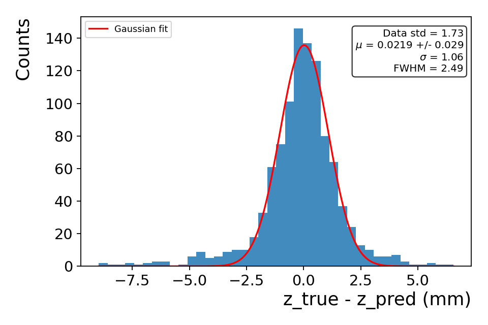

# 3 · Evaluate saved predictions

## Why am I doing this?

You can study an already-trained model’s position estimates and predicted uncertainties without training it again. This exercise uses the **first 1,024 rows of a historical K = 8 prediction file**. It is not a random sample guaranteed to represent the original run, and it is not the n16/50M study.

!!! note "Saved outputs, not checkpoint weights"
    The package includes the predicted coordinates, uncertainties and mixture parameters. It does not contain trained weights. `evaluate_cnn_performance.py` reads these outputs; it cannot make new predictions from new input maps.

## What do I run?

**Working directory: `project/hpc-15-07`**, analysis environment active.

```bash
python evaluate_cnn_performance.py  \
  --predictions-csv ../hpc/local-cnn-zgmm-plain-test/test-predictions-with-uncertainty.csv  \
  --outdir student-runs/predictions  \
  --no-per-pixel-plots  \
  --n-z-resolution-bins 4  \
  --n-pred-z-condition-bins 4  \
  --n-pred-z-condition-gmm-components 2  \
  --z-gmm-point-estimators mean
```

The command above evaluates the mixture mean. The [three-estimator command](estimators.md) also evaluates the median and mode, producing a subfolder for each estimator. See the [example data checks](../reference/data-checks.md) for input details and limitations.

The four-bin settings make diagnostics manageable for this excerpt. `--n-pred-z-condition-gmm-components 2` controls a **separate fit to conditional histograms**, not the CNN’s K = 8. `--no-per-pixel-plots` also stops loading channel columns, so derived neighbourhood diagnostics may be absent.

## What should I see?

Open `student-runs/predictions/index.html`. A single estimator writes directly into the chosen folder. Expect residual histograms, depth trends, uncertainty plots, conditional histograms, metrics and a clickable image gallery. Start with **`pull-z.png`**, then **`residual-mean-vs-true-z.png`**, rather than trying to interpret every figure at once.

<figure class="figure">
<a href="../assets/prediction-residual-z.png" title="Open full-size figure"></a>
<figcaption>Mean-estimator evaluation of the supplied prediction excerpt. Despite its `pull-z.png` filename, this plot shows dimensional residuals in mm. It is not an uncertainty-normalized pull.</figcaption>
</figure>

## How do I know it worked?

The residual convention is **truth − prediction**. Positive z residuals mean the prediction lies at smaller z than truth. Compare x, y and z units and inspect fit-success flags in `metrics-standalone-eval.json`.

Check the saved density parameters directly:

```bash
python - <<'PYCODE'
import numpy as np
import pandas as pd
p = '../hpc/local-cnn-zgmm-plain-test/test-predictions-with-uncertainty.csv'
df = pd.read_csv(p)
w = df[[f'z_gmm_weight_{k}' for k in range(8)]].to_numpy()
s = df[[f'z_gmm_sigma_{k}' for k in range(8)]].to_numpy()
assert np.isfinite(w).all() and (w >= 0).all()
assert np.isfinite(s).all() and (s > 0).all()
assert np.allclose(w.sum(axis=1), 1, atol=1e-6)
print('Rows:', len(df), '| K:', w.shape[1])
print('Largest weight-sum error:', np.abs(w.sum(axis=1)-1).max())
PYCODE
```

This is an input consistency check, not a new performance calculation. The excerpt lacks incident-energy and incident-angle metadata. An angle plot is therefore skipped, and a narrow-energy attenuation selection cannot be enforced. These omissions are expected for this input.

## Questions to discuss

- What is the difference between a zero mean residual and a narrow residual distribution?
- Why can a globally small bias hide depth-dependent bias?
- Which additional files would be required to run the model on a new feature CSV?

<div class="next" markdown>Next: [interpret uncertainty →](uncertainty.md)</div>
