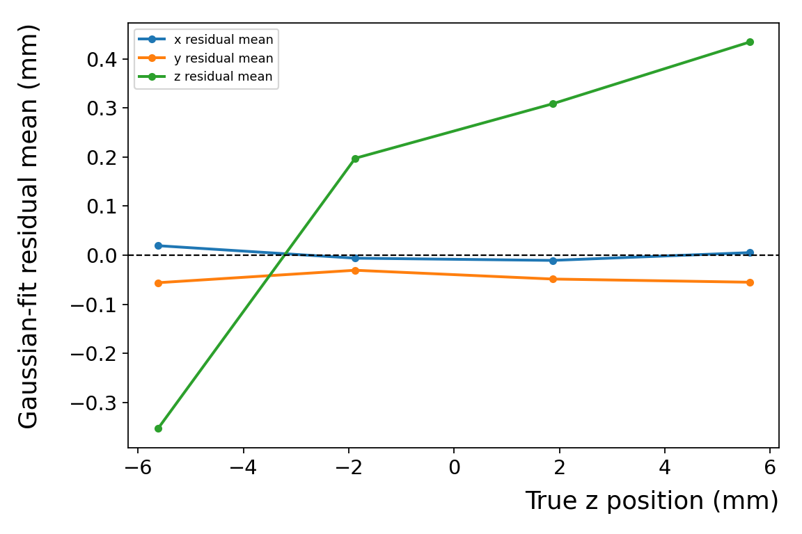

# 4 · Interpret uncertainty

## Why am I doing this?

A model can have a narrow residual core but important tails. It can also assign small uncertainties to some inaccurate events. Read several diagnostics together before deciding whether a reconstruction or selection is useful.

## What do I run?

Use the gallery generated in [Practical 3](predictions.md). **No additional computation is needed.** Open `project/hpc-15-07/student-runs/predictions/index.html`, and inspect the residual, uncertainty and coordinate-distribution plots alongside `metrics-standalone-eval.json`.

## What should I see?

| Quantity | What it measures | Main limitation |
| --- | --- | --- |
| Mean residual | Signed average bias | Cancellation can hide structure |
| Fitted FWHM | 2.355 × the fitted Gaussian σ | Describes the fitted core; sensitive to fit range and failures |
| Population standard deviation | Spread about the sample mean, `ddof=0` | Does not include bias in the same way as RMSE |
| MAE | Average absolute error | Gives a different penalty to large errors than RMSE |
| RMSE | Square root of mean squared error | Sensitive to bias and tails |
| Normalized residual | `(truth − prediction) / predicted σ` | A skewed mixture need not produce Gaussian normalized residuals |

<figure class="figure">

<figcaption>Generated with the unchanged evaluator for the K = 8 excerpt and mean estimator. Examine bin populations and fit flags before interpreting apparent depth trends.</figcaption>
</figure>

## How do I know which events were selected?

There are three distinct selection conventions:

| Diagnostic | Selected population |
| --- | --- |
| Per-axis median-uncertainty residual plot | x uses σx below its median, y uses σy, z uses σz; these are different samples |
| Second coordinate-distribution row and depth-sliced low-σz row | One common σz-below-median sample for all three coordinates |
| Quality scan | Threshold on `q = sqrt[(σx/median σx)² + (σy/median σy)² + (σz/median σz)²]` |

A reported retained fraction is relative to eligible evaluated rows. It is **not absolute scanner sensitivity**: undetected or previously rejected gammas are already absent. The quality scan’s median scales come from the evaluated sample; deployment would need a fixed, independently calibrated definition.

## How do I know it worked?

Write a short comparison for one coordinate: the all-event result, the uncertainty-selected result, the retained fraction and whether each fit succeeded. State explicitly whether you are comparing the same event set across coordinates.

A selection that reduces residual spread may be useful, but it does not prove calibrated uncertainties. Coverage of probability intervals and density calibration remain separate questions. When switching the z estimator to median or mode, the uncertainty remains the original mixture standard deviation.

## A common interpretation trap

The true-z histograms in bins of predicted z estimate `p(z | predicted z in a bin)`. They combine multiple input images. Their fitted diagnostic GMM is not the network’s per-event `p(z | X)`.

## Questions to discuss

1. Could a predictor that always returns zero look deceptively good in a central truth bin?
2. Does a narrower fitted FWHM necessarily imply a lower RMSE?
3. What fraction of events would you accept losing, and which scientific task determines that choice?

Next: [compare mean, median and mode →](estimators.md)

