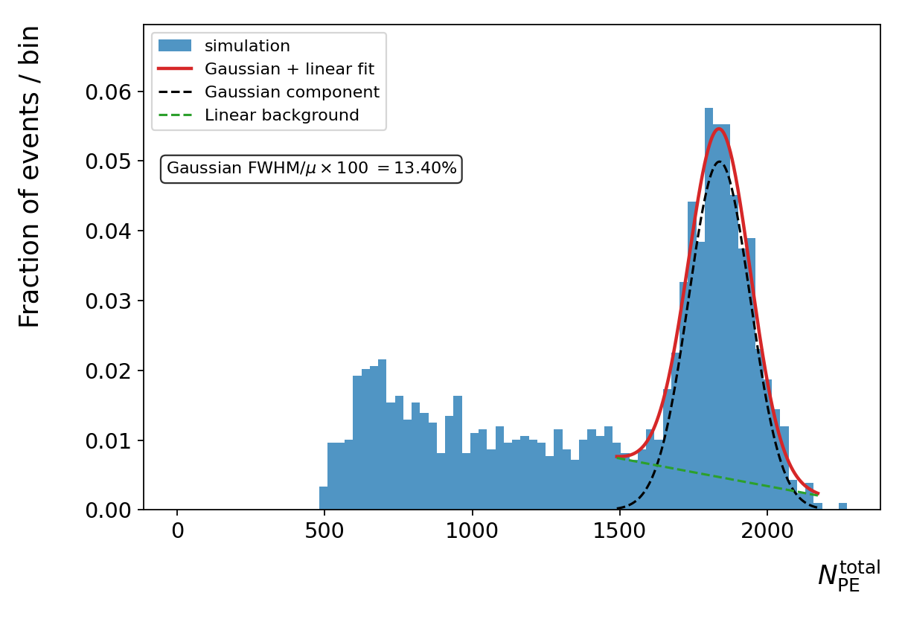

# 2 · Validate the distributions

<span class="status">Feature-CSV evaluation</span>

## Why am I doing this?

Inspect the light response and retained interaction-depth distribution before judging a CNN. The script’s “validation” plots are diagnostic checks of a dataset, not a certificate that every physical assumption is correct.

## What do I run?

**Working directory: `project/hpc-15-07`**, analysis environment active.

```bash
python evaluate_cnn_performance.py  \
  --predictions-csv ../hpc/test.csv  \
  --outdir student-runs/validation  \
  --incident-energy-window-kev 1.0  \
  --pe-spectrum-mode-min 100  \
  --pe-spectrum-fit-fraction 0.35  \
  --pe-spectrum-fit-low-fraction 0.18  \
  --pe-spectrum-fit-high-fraction 0.25
```

The argument is called `--predictions-csv`, but prediction columns are optional. With this feature CSV, the script detects their absence and takes its **validation-only route**.

## What should I see?

Open `student-runs/validation/index.html` in a browser. Expect six PNGs and `metrics-standalone-eval.json`, including total-PE, visible-energy, maximum-channel, raw-z, attenuation-depth and incident-angle plots. The website includes selected example figures so you can orient yourself before opening the full gallery.

<figure class="figure">
<a href="../assets/validation-total-pe.png" title="Open full-size figure"></a>
<figcaption>Total photoelectron spectrum from the supplied feature CSV. A Gaussian-plus-linear-background fit uses a restricted window around the selected peak. This small historical sample is not a production performance reference.</figcaption>
</figure>

## How do I know it worked?

Check the output folder, the process exit status and the metric fields together. This small inspection prints fit and selection fields without reimplementing calculations:

```bash
python - <<'PYCODE'
import json
from pathlib import Path
m = json.loads(Path('student-runs/validation/metrics-standalone-eval.json').read_text())
def inspect(value, path=''):
    if isinstance(value, dict):
        for key, item in value.items():
            here = f'{path}.{key}' if path else key
            if key in {'fit_ok', 'energy_selection', 'n_energy_window'}:
                print(here, '=', item)
            inspect(item, here)
inspect(m)
PYCODE
```

A successful program exit does not mean every fit succeeded. In the example results, the maximum-channel spectrum reports `fit_ok = false`; the total-PE and visible-energy fits report true. The selected-step 511 keV window contains 814 rows. These are checks of this specific example, not performance benchmarks. A plot can show a fallback estimate; inspect `fit_ok` before quoting a fitted width.

## Read the physics carefully

**Total light and visible energy.** The visible-energy axis maps the selected total-PE histogram mode to 511 keV and zero to zero. This is an assumed calibration. It is not the sum of true energy deposits. Maximum-channel PE stays in count units because light sharing and selecting the maximum complicate its energy interpretation.

**Depth attenuation.** The depth plot uses `d = z + 7.5 mm`. The evaluator fits a narrow-cone average of truncated exponential models. It normally selects incident energy within 1 keV of 511 keV **at the selected step**. If fewer than 50 events pass, it falls back to all energies. Check the actual `energy_selection`, not just the command-line request.

**Raw z and attenuation plots.** Their coordinate origins and retained populations can differ. Do not overlay them mentally as though they were the same histogram.

**Spectral annotations.** Labels on a plot express an interpretation. In particular the script’s 180 keV constant follows its chosen source cutoff; it is not a universal Klein–Nishina constant.

## Common failures and questions

- If prediction-column warnings appear, that is expected for this feature-only route.
- If there are too few events for a fit, do not turn a fallback estimate into a claimed measurement.
- If comparing another dataset, record its input identity and selections first.

Why can selecting events by total light distort an attenuation measurement? Why is the optical-photon absorption length different from the gamma attenuation length? What additional information would turn this historical sample into an approved baseline?

<div class="next" markdown>Next: [evaluate saved predictions →](predictions.md)</div>
